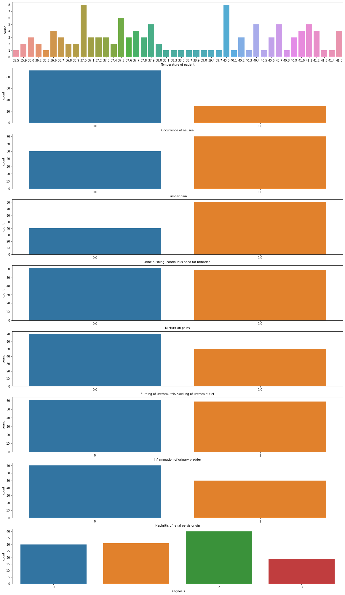
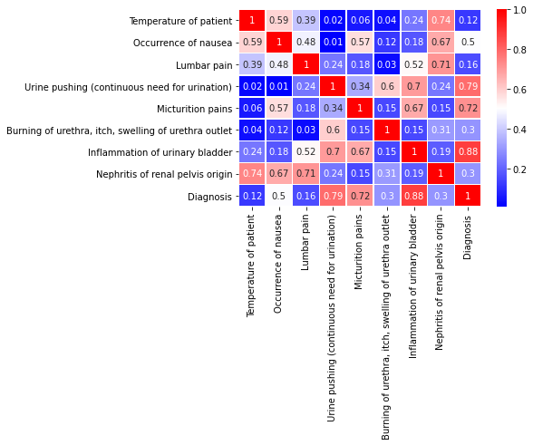
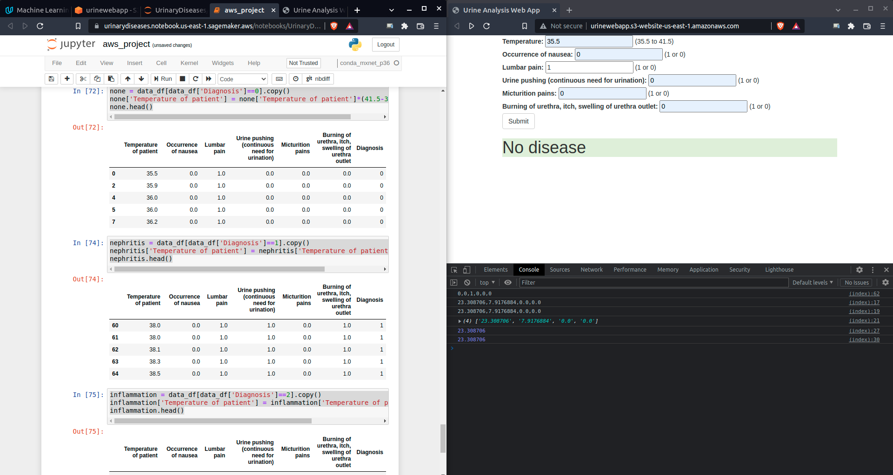
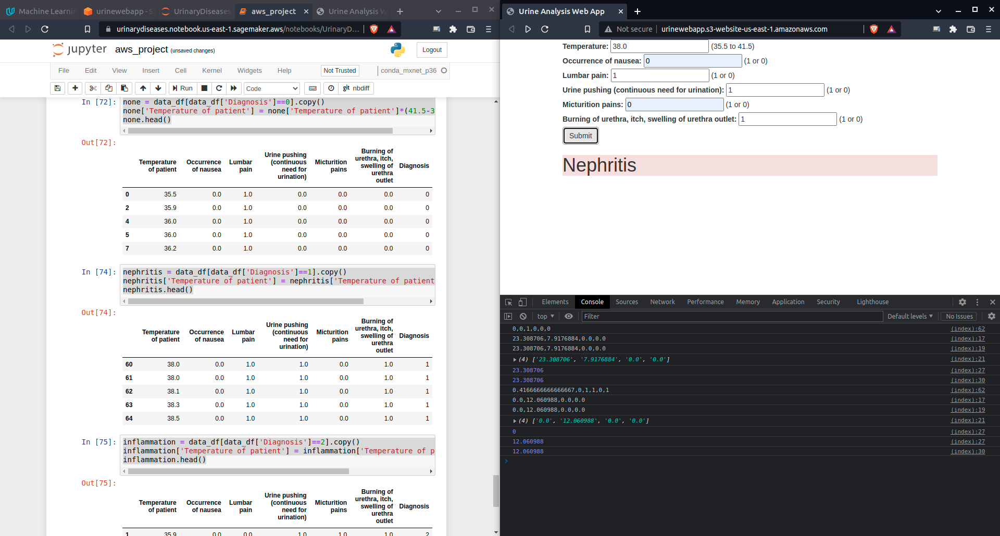
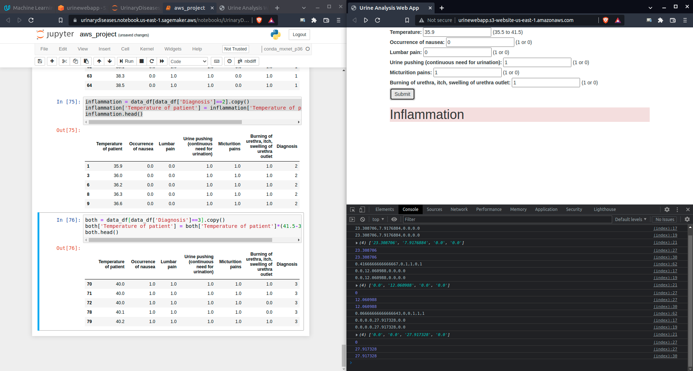
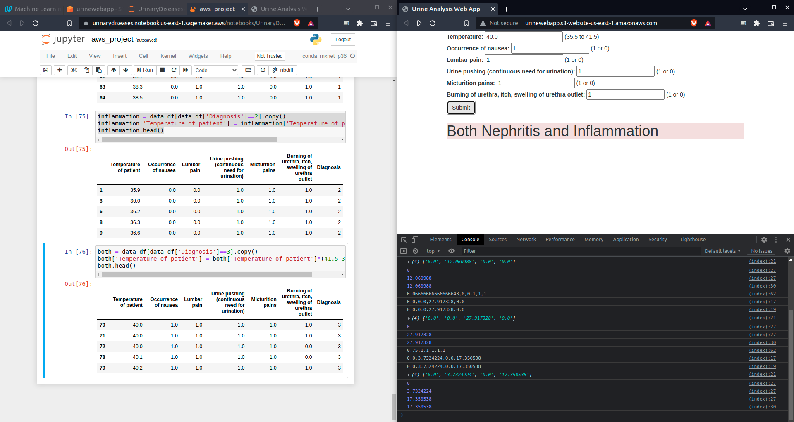

# Machine Learning Engineer Nanodegree
## Capstone Project
Bruno Cabral  
February 23rd, 2022

## I. Definition

### Project Overview
For this project I decided to work with the dataset “Urinary system diseases classification” found on Kaggle at https://www.kaggle.com/yamqwe/acute-inflammationse. Improving diagnoses can help patients to have an early treatment, faster recovery and less spending with medical routines, surgeries and medications. This is a great incentive for me to work on this data because even I am a software developer I can help others with serious problems in their lives.

### Problem Statement
The objective is to create a machine learning model that will receive the symptoms as input and inform if the patient has one of the diseases, both or none. The model will train in a larger sample of the given dataset and evaluate on the smaller sample from the same dataset. I am also going to create a webpage in AWS where new data can be provided to the model and it will return the expected diagnose.

### Credit
The dataset requires to give citation and credit:

    Citation Request:
    J.Czerniak, H.Zarzycki, Application of rough sets in the presumptive diagnosis of urinary system diseases, Artifical Inteligence and Security in Computing Systems, ACS'2002 9th International Conference Proceedings, Kluwer Academic Publishers,2003, pp. 41-51

Source: http://archive.ics.uci.edu/ml/datasets/Acute+Inflammations 

### Metrics
My Neural Network model can be evaluated using accuracy metric, if the calculated diagnose is the same as the given label.

## II. Analysis

### Data Exploration
The given dataset has 6 symptoms and two diagnoses, but both diagnoses can be “yes” at the same time, which means the patient has both diseases, or “no” for both, which means the patient doesn’t have any of these diseases (it is not clear from the dataset if the patient is healthy, but it is not any of these two diseases in this project).

These are the symptoms, given in order in the dataset:
1. Temperature of patient – number from 35.5 to 41.5 (Celsius degree)
2. Occurrence of nausea – yes or no
3. Lumbar pain – yes or no
4. Urine pushing (continuous need for urination) – yes or no
5. Micturition pains – yes or no
6. Burning of urethra, itch, swelling of urethra outlet – yes or no  

The dataset has two columns, one for each diagnose, they can also be both yes or both no
1. Inflammation of urinary bladder – yes or no
2. Nephritis of renal pelvis origin – yes or no
       
The dataset file is a TAB separated file, for each row, each symptom is separated by a tab character \t.

In the python jupyter notebook I tried to remove any row with missing values, but no row had any missing values, the returned dataframe was the same as the initial one.

```
data_df = data_df.dropna(axis=0)
data_df.shape
(120, 8)
```  
symptoms that can be "yes" or "no" will be converted to binary values 1 or 0. Temperature will be scaled between 0 and 1 so that the high float numbers don't weigth too much our ML model. As we can have 4 possible diagnosis, they will receive values of 0, 1, 2 or 3, where 0 is no disease encountered, 1 is only Nephritis, 2 is only Inflammation and 3 means both diseases were diagnosed.

### Exploratory Visualization

In python jupyter notebook I have plotted the symptoms and the categorized diagnosis. 
```
fig, ax =plt.subplots(len(data_df.columns),1, figsize=(20,4*len(data_df.columns)))
for i, c in enumerate(data_df.columns):
    sns.countplot(data=data_df, x=c, ax=ax[i])
fig.show()
```
 

Also, a correlation matrix was plotted.

```
corr_matrix = data_df.corr().abs().round(2)
sns.heatmap(corr_matrix, annot=True, cmap='bwr', linewidths=.5)
```
 


Temperatures are distributed in two main groups, less than 38 and above 40. There is no value for all decimals, but scaling from 0 to 1 will give a good approximation when dealing with new patients.   
The most imbalanced symtom is Nausea, this could indicate this is a common symptom for any patient.  
The Diagnosis is well distributed, Inflammation has a bit more samples, but nothing that could create a bias in the model.

### Algorithms and Techniques
I'm using a custom PyTorch model, with one input layer and two hidden layers. The idea is that each hidden layer will be able to separate each disease. The output has 4 possible values, one for each diagnosis. This is different from what we have seen during the course, where all examples so far were Binary classification, this will be a multiple classification problem.  
One problem I have encountered during the project was that at first I used the most updated PyTorch version 1.10, but Sagemaker has support for up to 1.9.1. I was able to create the model in 1.9.1, but with some modifications.

### Benchmark
The paper in the citation concludes with a strict rule for determining the diagnose. My proposal is different as I am going to create a Neural Network model using PyTorch.  
  
I would like to point out that in my first model using PyTorch 1.10 I was able to reach 100% accuracy, but as Sagemaker supports only up to 1.9.1, modifications were needed and the model couldn't get the same results as we will se below.


## III. Methodology

### Data Preprocessing
The dataset file is a TAB separated file, not a CSV as seen in during the course. Also, enconding is UTF-16, we need to tell Pandas about it or the file won't open properly. As discussed above, Temperature will be scaled from 0 to 1 (35.5 to 41.5), and the other symptoms will be binery 0 or 1. The diagnosis can have 4 possible values, 0, 1, 2, or 3.  
There are no missing values in the dataset. No outliers values and no diagnosis imbalanced.


### Implementation
To read the file we need to give proper columns names, encoding and separated character.
```
columns = ['Temperature of patient', 'Occurrence of nausea', 'Lumbar pain', 'Urine pushing (continuous need for urination)', 'Micturition pains', 'Burning of urethra, itch, swelling of urethra outlet', 'Inflammation of urinary bladder', 'Nephritis of renal pelvis origin']
data_df = pd.read_csv(filepath_or_buffer=data_file, sep='\t', header=None, names=columns, encoding='utf-16')
```
Convert yes/no to 0/1 is a simple condition.
```
for c in columns[1:]:
    data_df.loc[data_df[c]=='no',c] = 0
    data_df.loc[data_df[c]=='yes',c] = 1
data_df.head()
```
The temperature is given with comma decimal, but we need to convert to point first, before any calculation.
```
data_df['Temperature of patient'] = data_df['Temperature of patient'].str.replace(',','.')
```
To scale the temperature at first I used sklearn module MinMaxScaler, but as Sagemaker doesn't come with it pre-installed I thought it would be wate of resources to install sklearn in Sagemaker for just a simple scaling problem. I could have done it by using a requirements.txt file, but as this is the only time we need sklearn, creating new training and enpoints instances with it would waste time creating the instances everytime I had to update something in the code. So, my model will expect to receive Temperature already scaled from 0 to 1 (35.5 to 41.4). It is up to the agent that is sending the data to scale it. This can be done with a simple formula:
```
scaled_temperature = (temperature - 35.5) / (41.5 - 35.5)
```
I am using this formula in the Web page created for new patient data. The test set is a subset of the given dataset, so, it is already scaled in the notebook.  
The result given by the model is a list of 4 values for each row sent, the highest value in the list indicates the index of the diagnosis, 0, 1, 2 or 3. Compare the index of the highest value with the given label. If they match, increase accuracy. Example: you have these values [36.1, yes, no, yes, no, no]. The data to be sent should be [0.1, 1, 0, 1, 0, 0]. The result is [0.0, 0.0, 7.827874, 8.08869]. The highest value is 8.08869, the index is 3, thus the diagnosis is "Both".

#### Implementation problems
I have encountered some problems during the implementation. 
- PyTorch version:  
To do initial training I was using my own machine and I had initially installed PyTorch 1.10, but right at the training script Sagemaker was throwing some erros that I could not reproduce. And the error messages had some suggestions, but they are misleading. After a few hours trying to change my script to fit the misleading suggestions, I have figure out that the problem was that Sagemaker was using version 1.0.0. I tried to create a requirements.txt to force the installation of torch==1.10.0, but Sagemaker error message said it was not supported. Then, reading the documentation I was able to conclude that the parameter `framework` is actually the torch version. It could have a better name, but let's move on. The documentation says that the higher supported version is 1.9.1, and then I was able to change my local version and put my code to work in Sagemaker without errors.
- Prediction output:  
In the predict function `predict_fn` the output from the model needs to be copied from the CUDA to the CPU and detached from the Torch Tensor created by the model. It took me another couple of hours to understand this because once more the Sagemaker error is unclear for the developer.
```
out_np = out.cpu().detach().numpy()
```
- Content type  
Both `input_fn` and `output_fn` functions have a parameter that represents the type of data that is being received, but the documentation is not clear on how this is used. The `input_fn` uses `content_type` and `output_fn` uses `accept`, which are related to HTML headers "Content Type" and "Accept". The examples in AWS documentation are too advance with no simple example. I had to search Stackoverflow and Github to check for other examples. From the course examples we have `application/x-npy` which represents a Numpy Array and is used in many examples and `text/plain` which is a string from the Plagiarism project. For this Urine project I had to change it to receive two types, `application/x-npy` and `text/csv`. The Numpy Array will be sent from my notebook, and the CSV will be sent from my web page.  
The Lambda function also needs both headers, `ContentType='text/csv', Accept='text/csv'`. This also took me a few hours of implementation because the API Gateway throws a CORS error, but in fact the Lambda function had the wrong header.  


### Refinement
My first script was using Torch==1.10.0, my model had one input layer and two hidden layers and the output was a log_sofmax function. The diagnosis was not the index, but a one hot encoded list. If the diagnosis is index 2, the one hot enconded is [0, 0, 1, 0]. With 1.10 I was able to get 100% accuracy on both training and test dataset with 100 epochs (at 70 the convergency to 100% was achieved). But Torch==1.9.1 loss functions can't deal with one-hot enconded labels. I had to rever back to indexing labels (0 to 3) and increase epochs.

## IV. Results

### Model Evaluation and Validation
Although the model from Torch==1.10 has better results, on Torch==1.9.1 the accuracy fell to 83% on test set (73% on training set) with 300 epochs. The test set has temperatures above 40, there could be a bias in the model, but it is a high percentage for a diagnosis. The web page successfully connects to the API Gateway and Lambda functions and it is able to get back the result for any given values (inside its constraints), so, it can be used for new patients detection. The results are better than my expectations, 83% with Torch==1.9.1 is already inline with what I wanted to achieve. We have only 6 symptoms, 5 are only yes/no questions, some of them could be represented better if we had more information from the patient. And the dataset is small, only 120 samples. And to get 100% with Torch==1.10 was incredible.

### Justification
The citation paper tries to summarize all symptoms into one unique result but ends up with 6 different stricted rules based on different symptoms combinations and at some point the paper had to do some approximations to get these rules. There is no indication on how well these rules are performed. My model was able to extrapolate the input values to any combination and has a high accuracy. The web page is a good place to try new patients.

## V. Conclusion


### Free-Form Visualization
The web page is the final representation of the project and it could be considered as a final product that could be used by real life doctors. The doctor would interview the patient, take their temperature and input these data into the web page that would return in less than a second what is diagnosis. An inexperience doctor has the same results as an expert, and the patient can be treated earlier.
- None disease  
  
- Nephritis  
  
- Inflammation  
  
- Both diseases  
  


### Reflection
For this project the most difficult part was to integrate the code in Sagemaker. As said many times above, the fact that Sagemaker doesn't support 1.10.0 took me a long time to solve. The training and predict scripts also had some online search to be done to make it ready for the final solution. In the end, the project is a success as it can give good results and it has a simple interface for a future user.

### Improvement
The dataset could be improved. It has only a few samples, 120. With more data we could explore more options. Also, some symptoms could be not just binary yes/no, for example "Lumbar pain" could be a scale from 1 to 5, or "Urine pushing" could be a ratio of how many urination per day. And there could be even more symptoms. The citation paper wanted a single formula, but the more symptoms the more difficult it is to have one formula. With a Machine Learning model the more symptoms the more accurate the diagnosis could be.  
As per the script, upgrading Sagemaker to Torch==1.10.0 could be a great improvement, as described above, there is a potential of 100% accuracy.

